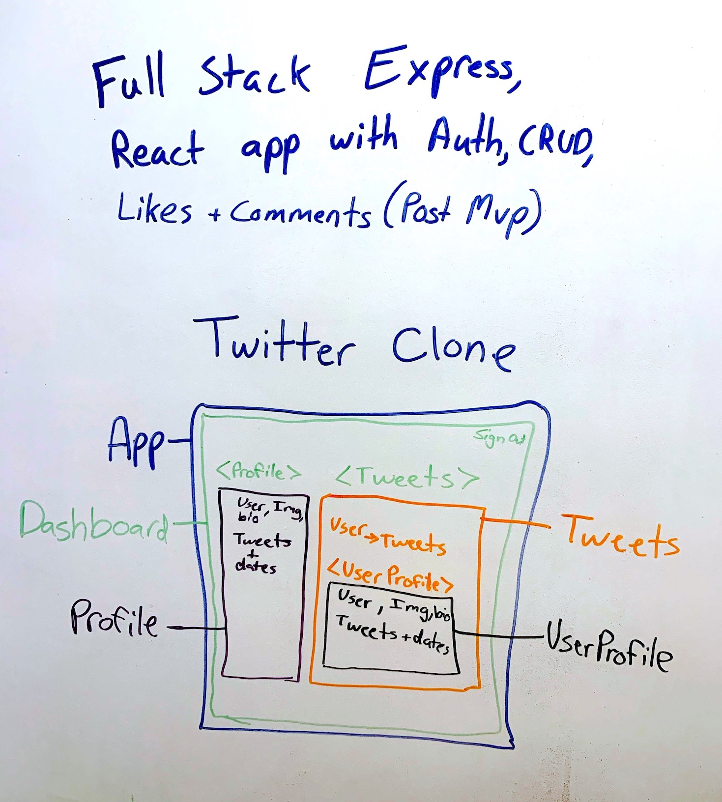

# twitter-clone
### Remake of Twitter. Full CRUD app with Express in the backend, SQL used as the database, and React in the frontend.
### Express and PassportJS is used to build out an API that provides authentication functionality (Login, Sign Up).

### Blue Print:             
  

### Associations:

