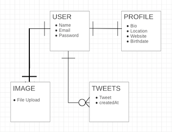

# twitter-clone
## [Demo Link](https://twitter-clone-client-three.vercel.app/)
### Remake of Twitter. Full CRUD app with Express in the backend, SQL used as the database, and React in the frontend.
### Express and PassportJS was used to build out an API that provides authentication functionality (Login, Sign Up).
### Image Upload was made using multer and uploaded on Cloudinary.

### Demo Image:

### Blue Print:             
  

### Associations:

